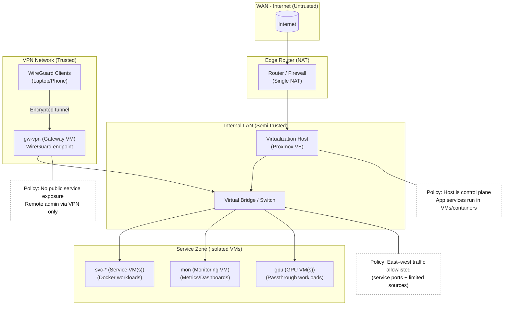

# Network overview

High-level trust zones and VPN-only remote access path. All identifiers are placeholders.

```mermaid
flowchart TB
  %% Trust zones
  subgraph WAN["WAN - Internet (Untrusted)"]
    Internet[(Internet)]
  end

  subgraph EDGE["Edge Router (NAT)"]
    Router["Router / Firewall<br/>(Single NAT)"]
  end

  subgraph LAN["Internal LAN (Semi-trusted)"]
    Host["Virtualization Host<br/>(Proxmox VE)"]
    Sw["Virtual Bridge / Switch"]
  end

  subgraph VPN["VPN Network (Trusted)"]
    WGClients["WireGuard Clients<br/>(Laptop/Phone)"]
    GW["gw-vpn (Gateway VM)<br/>WireGuard endpoint"]
  end

  subgraph SRV["Service Zone (Isolated VMs)"]
    SVC["svc-* (Service VM(s))<br/>(Docker workloads)"]
    MON["mon (Monitoring VM)<br/>(Metrics/Dashboards)"]
    GPU["gpu (GPU VM(s))<br/>(Passthrough workloads)"]
  end

  %% Connectivity
  Internet --> Router
  Router --> Host
  Host --> Sw

  WGClients -->|Encrypted tunnel| GW
  GW --> Sw

  Sw --> SVC
  Sw --> MON
  Sw --> GPU

  %% Notes / policies
  classDef note fill:#fff,stroke:#999,stroke-dasharray: 3 3,color:#111;

  N1["Policy: No public service exposure<br/>Remote admin via VPN only"]:::note
  N2["Policy: Host is control plane<br/>App services run in VMs/containers"]:::note
  N3["Policy: East–west traffic allowlisted<br/>(service ports + limited sources)"]:::note

  GW --- N1
  Host --- N2
  Sw --- N3
```