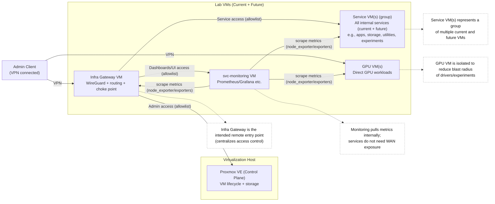

```mermaid
flowchart LR
  Client["Admin Client<br/>(VPN connected)"]

  %% Keep host separate; short title prevents clipping in some renderers
  subgraph Host["Virtualization Host"]
    PVE["Proxmox VE (Control Plane)<br/>VM lifecycle + storage"]
  end

  %% Main VM grouping (covers current + future)
  subgraph VMs["Lab VMs (Current + Future)"]
    IG["Infra Gateway VM<br/>WireGuard + routing + choke point"]
    GPU["GPU VM(s)<br/>Direct GPU workloads"]

    %% Monitoring (explicit identity)
    MON["svc-monitoring VM<br/>Prometheus/Grafana etc."]

    %% Collective group for all service VMs (now and later)
    SVC_ALL["Service VM(s) (group)<br/>All internal services (current + future)<br/>e.g., apps, storage, utilities, experiments"]
  end

  %% Access paths (admin reachability)
  Client -->|VPN| IG
  Client -->|VPN| GPU

  %% Admin plane (control plane access)
  IG -->|"Admin access (allowlist)"| PVE

  %% Service reachability (from VPN entry point)
  IG -->|"Service access (allowlist)"| SVC_ALL
  IG -->|"Dashboards/UI access (allowlist)"| MON

  %% Observability model (Prometheus pulls via exporters)
  MON -->|"scrape metrics (node_exporter/exporters)"| IG
  MON -->|"scrape metrics (node_exporter/exporters)"| SVC_ALL
  MON -->|"scrape metrics (node_exporter/exporters)"| GPU

  %% Notes (kept minimal to avoid layout distortion)
  classDef note fill:#fff,stroke:#999,stroke-dasharray: 3 3,color:#111;

  N1["Infra Gateway is the intended remote entry point<br/>(centralizes access control)"]:::note
  N2["Monitoring pulls metrics internally;<br/>services do not need WAN exposure"]:::note
  N3["GPU VM is isolated to reduce blast radius<br/>of drivers/experiments"]:::note
  N4["Service VM(s) represents a group<br/>of multiple current and future VMs"]:::note

  IG -.-> N1
  MON -.-> N2
  GPU -.-> N3
  SVC_ALL -.-> N4
```